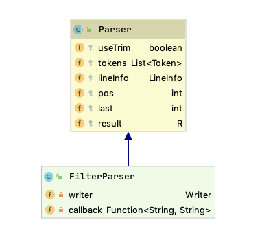

# Easy parser

Easy Parser is a library to help developers to build parser easily and simply way.

## How to use in two steps

1 - Configure the dependency in the maven file.
```
<repository>
    <id>easy-parser</id>
    <url>https://raw.github.com/rdabotelho/mvn-repo/easy-parser/</url>
</repository>
```
```
<dependency>
    <groupId>com.m2r</groupId>
    <artifactId>easy-parser</artifactId>
    <version>1.0.0</version>
</dependency>
```

2 - Create an inheritance from the parser class and sets the types of tokens expected for lexical analysis and context-free grammar.



## Example of a filter processor

The following example creates a filter processor that scans a properties file and replaces the parameters with the corresponding value.

Properties file
```
Group=${project.group}
Name=${project.name}
```

Regular expression for lexical analysis
```
ID          -> [a-zA-Z][a-zA-Z0-9_\\.]*
DELIMITER   -> [\\$\\{\\}]
SPACE       -> \\s
OTHER       -> .
```

Context-Free Grammar
```
EXP                 -> <ANYTHING-LIST>
ANYTHING_LIST       -> <ANYTHING> <ANYTHING_LIST> | <ANYTHING>
ANYTHING		    -> PROPERTY | ID | SPACE | OTHER
PROPERTY		    -> DELIMITER($) DELIMITER({) ID DELIMITER(})
```

Implementation of the filter parser using easy parser
```
public class FilterParser extends Parser<Writer> {
	
	private Writer writer;
	private Function<String, String> callback;
	
	static private enum TokenType implements ITokenType {
		
		ID("[a-zA-Z][a-zA-Z0-9_\\.]*"),
		DELIMITER("[\\$\\{\\}]"),
		SPACE("\\s"),
		OTHER(".");
		
		private Pattern regex;

		private TokenType(String regex) {
			this.regex = Pattern.compile("^("+regex+")");
		}
		
		public Pattern getRegex() {
			return regex;
		}
		
	}
	
	public FilterParser(Writer writer, Function<String, String> filter) {
		super(false);
		this.writer = writer;
		this.callback = filter;
	}
	
	@Override
	protected Object newResult() {
		return this.writer;
	}
	
	public static Writer parse(Reader reader, Writer writer, Function<String, String> filter) throws ParserException {
    	FilterParser me = new FilterParser(writer, filter);
		return me.execute(reader);
	}
	
	@Override
	protected ITokenType[] getTokenTypes() {
		return TokenType.values();
	}

	@Override
	protected boolean ignoreToken(Token token) {
		return false;
	}
	
	private boolean consume(int start) {
		Token tid = tokens.get(start);
		String value = tid.getValue();
		try {
			result.write(value);
		} 
		catch (IOException e) {
			e.printStackTrace();
		}		
		return true;
	}
	
	private boolean replace(int start) {
		Token tid = tokens.get(start + 2);
		String id = tid.getValue();
		String value = callback.apply(id); 
		try {
			result.write(value);
		} 
		catch (IOException e) {
			e.printStackTrace();
		}
		return true;
	}
	
	/**
	 * Context-Free Grammar
	 * 
	 * EXP				    -> <ANYTHING-LIST>
	 * ANYTHING_LIST	    -> <ANYTHING> <ANYTHING_LIST> | <ANYTHING>
	 * ANYTHING			    -> PROPERTY | ID | SPACE | OTHER
	 * PROPERTY			    -> DELIMITER($) DELIMITER({) ID DELIMITER(})
	 */
	
	@Override
	protected boolean exp() {
		int start = pos;
		return anythingList() || reset(start);
	}
	
	protected boolean anythingList() {
		int start = pos;
		return  isEnd() ||
				((anything() && anythingList()) || reset(start)) ||
				(anything() || reset(start));		
	}
	
	protected boolean anything() {
		int start = pos;
		return ((property() && replace(start)) || reset(start)) ||
			   ((term(TokenType.ID) && consume(start)) || reset(start)) ||
			   ((term(TokenType.SPACE) && consume(start)) || reset(start)) ||
			   ((term(TokenType.OTHER) && consume(start)) || reset(start));				
	}
	
	protected boolean property() {
		int start = pos;
		return (term(TokenType.DELIMITER, "$") && term(TokenType.DELIMITER, "{") && term(TokenType.ID) && term(TokenType.DELIMITER, "}")) || reset(start);
	}

}
```

Testing the filter parser
```
public class FilterTest {

	@Test
	public void test() throws Exception {
		String dir = System.getProperty("user.dir") + "/src/test/java/com/m2r/easyparser";
		InputStream in = new FileInputStream(dir +"/filter.properties");
	    byte[] buffer = IOUtils.toByteArray(in);
	    Reader reader = new CharSequenceReader(new String(buffer, StandardCharsets.ISO_8859_1));
	    StringWriter writer = new StringWriter();
		FilterParser.parse(reader, writer, (id) -> {
			if (id.equals("project.group")) {
				return "COM.M2R.PARSER";
			}
			else if (id.equals("project.name")) {
				return "PARSER-TESTE";
			}
			else {
				return id;
			}
		});
	    reader.close();		
	    reader = new CharSequenceReader(writer.getBuffer());
		Properties properties = new Properties();
		properties.load(reader);
	    reader.close();		
		writer.close();
		assertEquals(properties.getProperty("Group"), "COM.M2R.PARSER");
		assertEquals(properties.getProperty("Name"), "PARSER-TESTE");
	}
	
}
```

